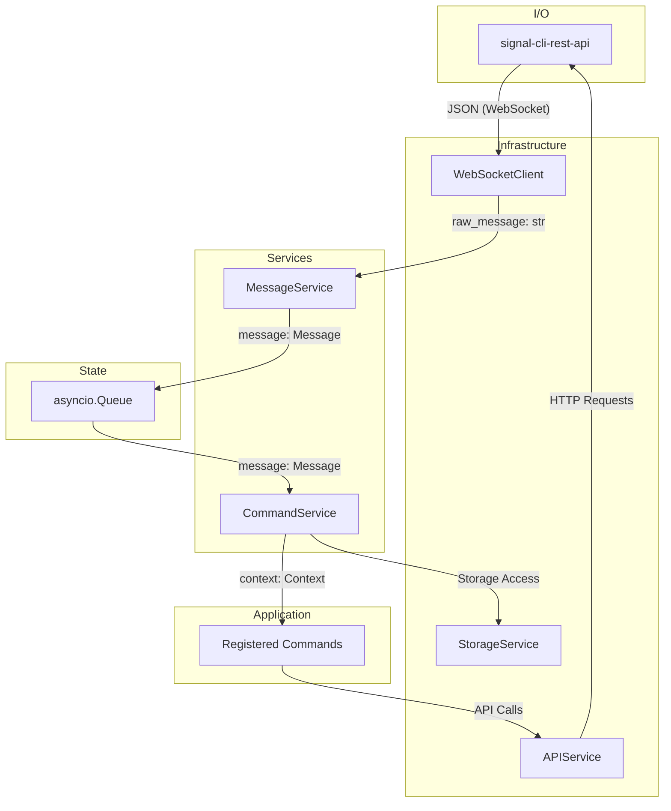

# Technical Architecture: signal-client

## 1. System Architecture

### 1.1. Design

- **Asynchronous**: Built on `asyncio` for non-blocking I/O.
- **Decoupled**: Services are loosely coupled via an `asyncio.Queue` and a `dependency-injector` container.
- **Service-Oriented**: Functionality is encapsulated in services with single responsibilities.

### 1.2. Component Diagram

### 1.3. Components

- **`Container`**: DI container for wiring system components.
- **`WebSocketClient`**: Manages the WebSocket connection and yields raw message strings.
- **`MessageService`**: Ingress point. Consumes raw JSON, deserializes into `Message` models, and enqueues them.
- **`CommandService`**: Consumes `Message` objects, matches them to registered commands, and executes the command's `handle` method.
- **`APIService`**: HTTP client for the `signal-cli-rest-api`. Used to send messages, reactions, etc.

## 2. Execution Flow

1.  **Init**: `SignalClient.start()` concurrently starts `MessageService.listen()` and `CommandService.process_messages()`.
2.  **Ingress**: `WebSocketClient` receives a JSON string.
3.  **Deserialization**: `MessageService` parses the JSON into a `Message` Pydantic model.
4.  **Enqueue**: The `Message` object is put onto the `asyncio.Queue`.
5.  **Dequeue**: `CommandService` receives the `Message` object.
6.  **Dispatch**: `CommandService` creates a `Context` object.
7.  **Match**: The service iterates through registered commands and calls `_should_trigger()` to find a match.
8.  **Execute**: The matched `command.handle(context)` is called.
9.  **Egress**: The command handler uses the `Context` object to call the `APIService` and send a response.

## 3. Core Abstractions

- **`Command` Protocol**: The contract for command handlers.
  - `triggers: list[str | re.Pattern]`: Activation patterns.
  - `whitelisted: list[str]`: Optional list of allowed callers.
  - `handle(self, context: Context)`: The command's business logic.
- **`Context` Object**: A stateful object providing a high-level API for command interaction.
  - `message: Message`: The inbound message.
  - `reply()`: Sends a message quoting the original.
  - `react()`: Adds an emoji reaction.
- **`Message` Model**: A Pydantic model representing an incoming message. It normalizes the Signal API's message structures.
