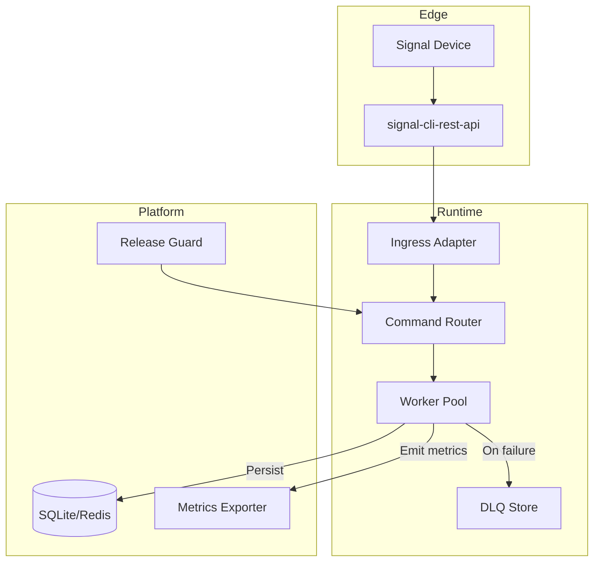

## System diagram



!!! info "CLI Integration"
    The CLI tools (`inspect-dlq`, `release-guard`, `audit-api`, `pytest-safe`) are utility commands that work alongside the Signal Client runtime. They provide debugging, monitoring, and testing capabilities for development and operations.

## Component responsibilities

| Component | Purpose | Notes |
| --- | --- | --- |
| Ingress adapter | Normalises webhook payloads, polls the REST API when webhooks are unavailable. | Handles authentication and backpressure. |
| Command router | Routes to registered async commands and applies middleware (retry, dedupe, audit). | Commands are regular async functions with typed context. |
| Worker pool | Runs commands concurrently with APScheduler-managed backoff. | Handles multiple messages at once. |
| DLQ store | Captures failed jobs with payload snapshot and error context. | Inspect with `inspect-dlq` CLI tool. |
| Observability | Emits structured logs and basic metrics. | Track bot performance and errors. |

## Deployment modes

/// details | Local development
- Use the embedded SQLite store for message queuing and state management.
- Run your Signal Client application directly with Python for development.
- Webhook fallback polls every 5 seconds via the REST API `receive` endpoint.
- Great for prototyping commands and iterating on content.

```python
# Example: local development setup
import asyncio
from signal_client.bot import SignalClient

async def main():
    client = SignalClient()
    # Register your commands here
    await client.start()

if __name__ == "__main__":
    asyncio.run(main())
```
///

/// details | Simple server deployment
- Run your bot on a VPS or home server with Docker or systemd
- Use SQLite for simple persistence, or Redis if you need more features
- Set up log rotation and basic monitoring
- Perfect for personal bots or small group automation
///

/// details | Production deployment
- Use a process manager like systemd or supervisor
- Set up proper logging and error alerting
- Use environment variables for configuration
- Consider backup strategies for your bot's data
///

## Key management flow

> _Placeholder diagram_: The Excalidraw scene `excalidraw/key-management.json` (added via `mkdocs serve`) walks through key provisioning, rotation, and storage. Open it in the dev server to iterate or export SVGs for presentations.

!!! warning "Do not store keys alongside code"
    Mount the Signal credential volume from a secret manager or encrypted filesystem. Restrict host access and rotate regularly to mitigate leaked credentials.

> **Next step** · Configure runtime settings in [Configuration](configuration.md) and wire them into your deployment pipeline.
