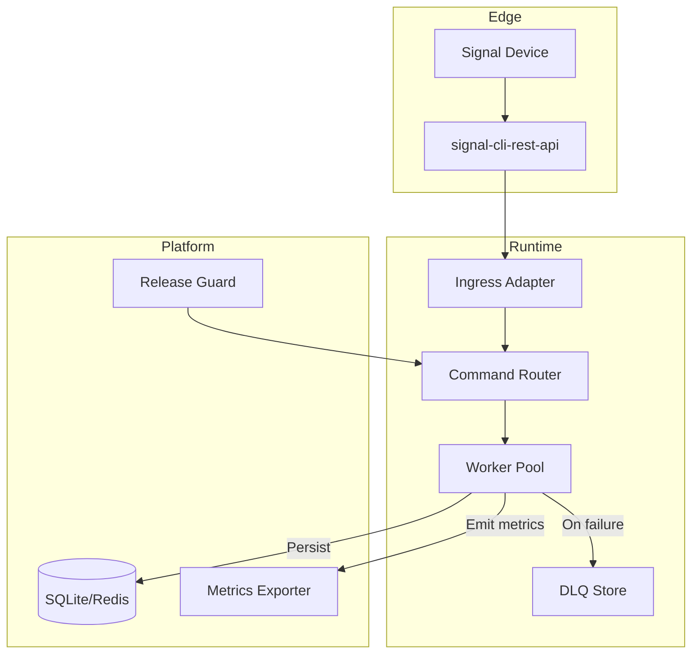

## System diagram

!!! info "Where the CLI fits"
    The CLI shells (`signal-client send`, `signal-client compatibility`) are thin Typer applications that bootstrap the same container used by workers. Command registration is shared, so tests and production rely on identical dependency injection wiring.

## Component responsibilities

| Component | Purpose | Notes |
| --- | --- | --- |
| Ingress adapter | Normalises webhook payloads, polls the REST API when webhooks are unavailable. | Handles authentication and backpressure. |
| Command router | Routes to registered async commands and applies middleware (retry, dedupe, audit). | Commands are regular async functions with typed context. |
| Worker pool | Runs commands concurrently with APScheduler-managed backoff. | Horizontal scaling supported via process count or Kubernetes. |
| DLQ store | Captures failed jobs with payload snapshot and error context. | Inspect with `signal-client dlq inspect`. |
| Observability | Emits structured logs and Prometheus metrics (`signal_client_*`). | Ship to Grafana or Datadog. |

## Deployment modes

/// details | Local development (CLI only)
- Use the embedded SQLite store and run `signal-client bot --reload` for autoreload.
- Webhook fallback polls every 5 seconds via the REST API `receive` endpoint.
- Great for prototyping commands and iterating on content.
///

/// details | Containerised worker (single node)
- Docker Compose with REST bridge, worker, and Prometheus sidecar.
- Mounts credential volume read-only, writes DLQ to persistent storage.
- Best for staging or small-scale production workloads.
///

/// details | Kubernetes fleet
- Workers run as a Deployment; REST bridge as StatefulSet pinned to node with egress.
- Redis or Postgres recommended for state. Scale workers horizontally using HPA tied to queue depth.
- Integrate release guard as an admission controller during rollout.
///

## Key management flow

> _Placeholder diagram_: The Excalidraw scene `excalidraw/key-management.json` (added via `mkdocs serve`) walks through key provisioning, rotation, and storage. Open it in the dev server to iterate or export SVGs for presentations.

!!! warning "Do not store keys alongside code"
    Mount the Signal credential volume from a secret manager or encrypted filesystem. Restrict host access and rotate regularly to mitigate leaked credentials.

> **Next step** · Configure runtime settings in [Configuration](configuration.md) and wire them into your deployment pipeline.
