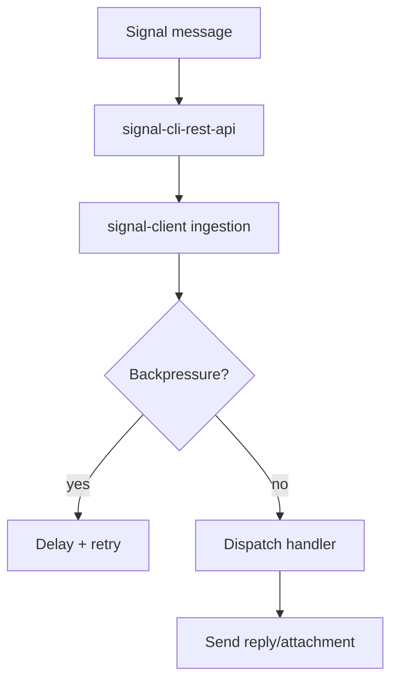

# Components playground

## Admonitions
!!! note "PII redaction"
    Incoming messages are redacted by default. Override with caution.

!!! warning "Backpressure"
    If the inbound queue exceeds the high watermark, new messages are deferred to protect upstream signal-cli.

## Tabs
=== "Local"
    ```bash
    poetry run mkdocs serve
    ```
=== "Docker"
    ```bash
    docker run -it --rm -p 8000:8000 -v $PWD:/docs squidfunk/mkdocs-material
    ```

## Cards
== Quick links
* :material-rocket: **Deploy** — see [Operations & Deployment](../guides/production_deployment.md)
* :material-code-tags: **API reference** — see [API Reference](../reference/api.md)
* :material-alert-decagram: **Release guardrails** — see [Release & Publishing](../guides/release.md)

## Diagrams


## Task lists and badges
- [x] Backpressure enabled
- [ ] Custom handler registered
- [ ] Metrics dashboard linked

Badge example: :material-shield-check: **Resilient path** uses retries + DLQ.

## Lightbox images
{ data-gallery="assets" }
