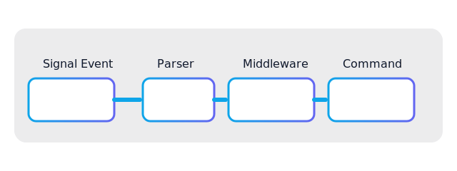
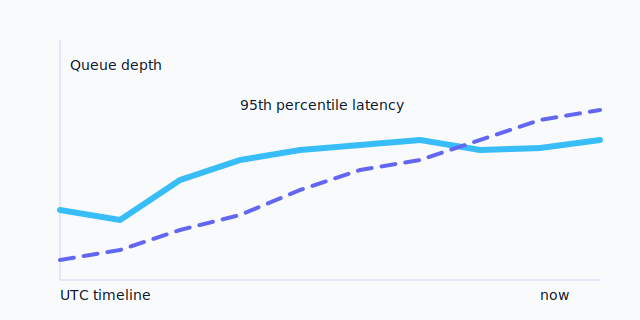

# Signal Client Documentation

|Signal Client|0.9.0|
|Python|3.11+|
L|GitHub|https://github.com/cornellsh/signal-client|

Signal Client is a Python runtime that layers reliability, typed commands, and observability on top of [`signal-cli-rest-api`](https://github.com/bbernhard/signal-cli-rest-api). This site helps two audiences:

- **Developers** who want a clear path from install to production-ready Signal bots.
- **Recruiters and collaborators** evaluating the craftsmanship and operations story behind the project.

{{ spotlight_stat("Median turnaround", "< 250 ms @ p95") }} {{ spotlight_stat("Commands in prod", "27 live playbooks") }} {{ spotlight_stat("Supported surfaces", signal.deployment_targets) }}

## Quick start checklist

1. Pair a Signal device and launch the REST bridge — see [Quickstart](quickstart.md#1-launch-signal-cli-rest-api).
2. Install the runtime and run the compatibility guard:
   ```bash
   pip install signal-client
   python -m signal_client.compatibility --strict
   ```
3. Register a command and start processing messages in minutes.

## Why teams adopt Signal Client

| Need | How Signal Client helps |
| ---- | ------------------------ |
| Dependable automation | Worker pools, rate limiting, circuit breakers, and a persistent DLQ keep Signal workflows healthy even when dependencies wobble. |
| Fast onboarding | Copy-and-paste quickstarts, typed configuration, and tested examples minimise the time from concept to running bot. |
| Operational visibility | Prometheus metrics, structured logging, and compatibility checks surface issues before they affect users. |
| Extensibility | Commands, middleware, background jobs, and storage providers are pluggable without forking. |

> **Maintainer note**
> This runtime is part of my personal portfolio. The docs showcase the architecture decisions, production practices, and polish you can expect if we work together.

## Operational snapshots

{{ read_csv("quick-facts.csv") }}

## Visual walkthrough

Click any tile to explore in detail.

{data-gallery="runtime"}

{data-gallery="runtime"}

## Navigation guide

- **Discover** – Start with the [Overview](overview.md), browse [Use Cases](use-cases.md), or take the [Feature Tour](feature-tour.md) to understand the runtime layers.
- **Build** – Follow the [Quickstart](quickstart.md), then dig into [Configuration](configuration.md), [Architecture](architecture.md), and the [API Reference](api-reference.md).
- **Operate** – Use the [Observability](observability.md) guide and [Operations runbooks](operations.md) to keep bots healthy in production.
- **Standards** – Review [Coding Standards](coding_standards.md), [Production Secrets](production_secrets.md), and the [TEE Privacy Architecture](tee_privacy_architecture.md) for security posture.

## Recent highlights & roadmap

- **Now** – Typed command context, compatibility guard, async worker pipeline, and full metrics coverage.
- **Next (Q1)** – Expanded security playbooks, secret rotation examples, and zero-trust guidance.
- **Later (Q2)** – Middleware gallery, enrichment helpers, and template bots for common workflows.

## Stay in touch

- Star or watch [the GitHub repository](https://github.com/cornellsh/signal-client) for release notes and roadmap updates.
- Open a [discussion](https://github.com/cornellsh/signal-client/discussions) to share what you build or request features.
